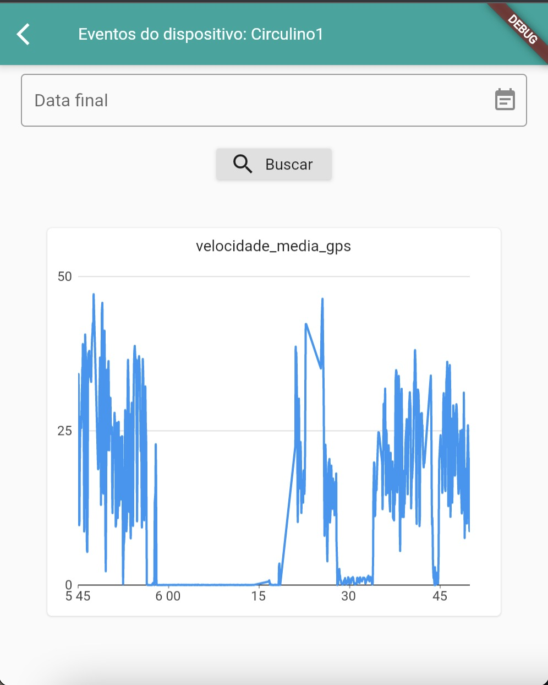

# Universidade Estadual de Campinas
# Instituto da Computação

## Disciplina: MC855-2s2021

### Professor e Assistente

| Nome                     | Email                   |
| ------------------------ | ------------------------|
| Professora Juliana Borin | jufborin@unicamp.br     |
| Assistente Paulo Kussler | paulo.kussler@gmail.com |

### Equipe

| Nome               | RA               | Email                  | ID Git                |
| ------------------ | ---------------- | ---------------------- |---------------------- |
| Lucas Fernandes André                   | 182495                 |    l182495@dac.unicamp.br                    |           lukeoluk            |
|      Gabriel Alves Tabchoury             |    171828              |         g171828@dac.unicamp.br               |           gtabchoury            |
|         Victor Fontana Saez           |      160013            |        v160013@dac.unicamp.br                |           vfsaez            |
|       João Agostinho Hergert             |                  |                        |                       |

### Descrição do projeto:
O projeto consiste em um aplicativo para a KonkerLabs. Seu intuito é o de proporcionar uma ferramenta de visualização para dispositivos IoT que estejam cadastrados em sua plataforma, com um funcionamento similar ao site deles porém melhor adaptado para o ambiente mobile.

### Prints das telas com descrição das funcionalidades. 

    
Prints das telas.

*Tela de login*

*Tela para realizar a criação de contas*

*Dashboard que fornece navegação para as funcionalidades do aplicativo*

*págino do perfil ao se deslizar da esquerda para direita*

*página para edição de perfil onde se pode atualizar informações da conta*

*tela que mostra os dispositivos da conta, também onde se pode excluir, editar, criar ou visualizar algum deles*

*tela que mostra os gateways da conta, também onde se pode excluir, editar ou criar algum deles*

*tela que mostra os destinos rest da conta, também onde se pode excluir, editar ou criar algum deles*

*tela que mostra os roteadores de eventos da conta, também onde se pode excluir ou criar algum deles*

*tela de criação de um dispositivo, tem visualização análoga para os destinos rest, roteador de eventos e gateways*

*tela de edição de um dispositivo, tem visualização análoga para os destinos rest, roteador de eventos e gateways*

*tela de visualização dos dados de algum dispositivo, onde se pode definir qual dos dados fornecidos pelo dispositivo será usado e as datas limite de início e fim*

### Tecnologias, ferramentas, dependências, versões. etc. 
A ferramenta principal utilizada foi a linguagem flutter, que é uma linguagem que traz a possibilidade de o desenvolvimento de uma aplicação para as mais diferentes plataformas, desde IOS, Android e web. Para visualização, teste de features e demonstrações, utilizamos uma ferramenta do AndroidStudio que nos permitia rodar uma simulação de um celular Android específico. FOi utilizada a versão 2.5.3-stable do flutter. Para o simulador Android, foi utilizado o device Pixel 2 API 30. É necessário instalar tanto o FLutter quanto o AndroidStudio para executar o projeto da mesma maneira que fizemos.

### Ambientes
flutter com android virtual.
apresentam-se a seguir alguns links úteis:
- [Lab: Write your first Flutter app](https://flutter.dev/docs/get-started/codelab)
- [Cookbook: Useful Flutter samples](https://flutter.dev/docs/cookbook)
- [online documentation](https://flutter.dev/docs)

### Como colocar no ar, como testar, etc
Após ter o flutter instalado e o simulador de ambiente Android, é necessário apenas abrir a pasta do projeto em sua IDE favorita (demos preferência ao VScode), rodar o arquivo main.dart, o android simulado irá ser aberto e rodar a aplicação, ela estará funcional e navegável.

### Como acessar, quem pode se cadastrar(regras de acessos), etc.
O acesso é simples, é necessário apenas fornecer o login e senha de uma conta existente. A criação de contas também é simples e já implementada, sem maiores obstáculos.

### Repositório da Professora Juliana no Gitlab do IC ou Zip com o projeto e todos artefatos para futuras evoluções dos projetos por outros alunos das turmas seguintes

